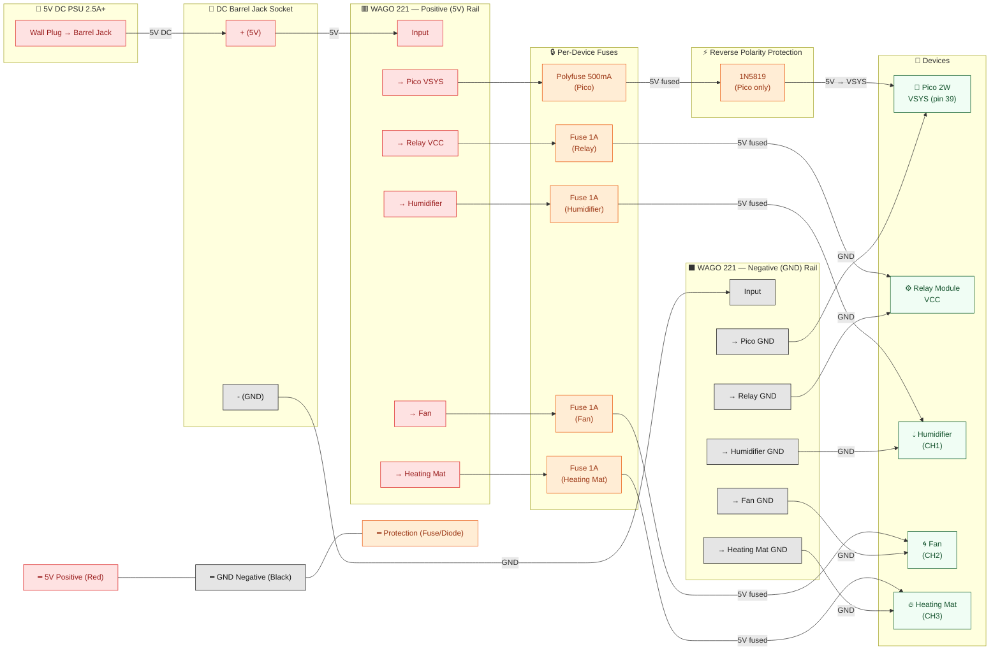

# Hardware Reference — Mushroom Pi Growing Unit

Bill of materials, pin map, wiring reference, and power analysis for the Raspberry Pi Pico 2W growing unit.

## Bill of Materials

| # | Component | Model / Variant | URL | Notes |
|---|-----------|----------------|-----|-------|
| 1 | Microcontroller | Raspberry Pi Pico 2W | — | RP2350, dual-core, WiFi |
| 1 | Temperature & humidity sensor | DHT11 (standard, 4-pin module) | [tiendatec.es](https://www.tiendatec.es/maker-zone/sensores/588-sensor-dht11-temperatura-y-humedad-para-arduino-8405881480002.html) | Digital, single-wire protocol. Chequered accuracy. |
| 1 | Humidifier relay | 8-channel 5V relay module (SRD-05VDC) | [tiendatec.es](https://www.tiendatec.es/maker-zone/reles/645-modulo-rele-8-canales-5v-para-arduino-8406451430007.html) | Channels 1–3 used. 5 channels spare. Active-low by default. 5V VCC required. Optocoupler isolated. |
| 3 | — (relay channels used) | Channels 1, 2, 3 on the above module | — | Channel 1 = humidifier, channel 2 = fan, channel 3 = heater |
| 1 | Fan | 30×30×10mm 5V DC brushless | [tiendatec.es](https://www.tiendatec.es/raspberry-pi/accesorios/344-ventilador-30x30x10mm-5v-compatible-raspberry-pi-8403440020003.html) | Small form factor, 5V. Used for air circulation. |
| 1 | Humidifier | Basic ultrasonic mist maker (USB-powered) | [amazon.es](https://www.amazon.es/dp/B09BTKCTMC) | Placed in water reservoir. Toggled via relay channel 1. |
| 1 | Heating mat | USB-powered heating mat (low wattage, 5V) | — | Toggled via relay channel 3. USB cable cut, 5V line interrupted by relay COM3/NO3. Low-voltage — no mains in the grow chamber. |
| 1 | Power supply | 5V 2A+ DC power supply (mandatory) | — | Dedicated PSU for relay module and all actuators. Not run through the Pico's USB port. |

## Pin Map

| GPIO | Component | Signal | Notes |
|------|-----------|--------|-------|
| 0 (GP0) | Force-provision input | — | Internal pull-up (33kΩ–60kΩ). Hold LOW at boot (momentary switch to GND) to force AP provisioning mode. |
| 4 (GP4) | DHT11 | DATA | Single-wire digital. Internal pull-up used. |
| 6 (GP6) | Relay channel 1 (humidifier) | IN1 | Active-low by default. Configurable via `active_high` in `config.json`. |
| 7 (GP7) | Relay channel 2 (fan) | IN2 | Active-low by default. |
| 8 (GP8) | Relay channel 3 (heater) | IN3 | Active-low by default. |
| `LED` | Onboard LED | — | Status indicator. **OFF** = no WiFi link (boot, AP-mode setup, or runtime link-down). **CONFIG ERROR** = config invalid at boot; unit stays offline. **SOLID** = WiFi connected, hub announce pending or failed. **BLINKING** = fully operational (announced, polling normally). **SLOW DOUBLE-BLINK** (200/200/200/800ms) = AP provisioning mode. |

### Available GPIOs

The following pins are **unused** and available for expansion:

- GPIO 1, 2, 3, 5, 9, 10, 11, 12, 13, 14, 15, 16, 17, 18, 19, 20, 21, 22, 26, 27, 28
- All ADC pins (26, 27, 28) — usable for analog sensors
- I2C0 (GP1 only; GP0 reserved for force-provision) and I2C1 (GP2/GP3) — available for I2C sensors
- SPI0 and SPI1 — available for SPI devices

## Wiring Reference

### DHT11
- **VCC** → Pico 3V3 (pin 36)
- **GND** → Pico GND (any)
- **DATA** → GPIO 4 (pin 6)
- Internal pull-up enabled in firmware.
- Note: DHT11 accuracy is ±2°C temperature, ±5% humidity. Consider DHT22 for better accuracy in production.

### Relay Module (8-channel)
- **VCC** → External 5V (currently USB, should be dedicated PSU)
- **GND** → Pico GND (common ground)
- **JD-VCC** → Jumper set to use shared VCC (remove jumper if using separate relay coil power)
- **IN1** (channel 1) → GPIO 6 (humidifier)
- **IN2** (channel 2) → GPIO 7 (fan)
- **IN3** (channel 3) → GPIO 8 (heater)
- **IN4–IN8** → Unused (available for expansion)
- Active-low operation: relay engages when GPIO is LOW. Can be inverted via `active_high: true` in `config.json`.

### Fan (5V DC)
- Switched via relay channel 2.
- Fan positive → Relay COM2. Relay NO2 → 5V. Fan negative → GND.
- Alternatively: Fan positive → 5V. Fan negative → Relay NO2. Relay COM2 → GND.

### Humidifier (USB mist maker)
- Switched via relay channel 1.
- USB cable cut. 5V line interrupted by relay NO1/COM1.

### Heating Mat (USB-powered, 5V)
- Switched via relay channel 3.
- USB cable cut. 5V line interrupted by relay COM3/NO3. GND passes through uninterrupted. Data lines cut and insulated.
- Same wiring method as the USB humidifier and fan.

## Power

### Current Status
All components (Pico 2W, relay module logic, fan, humidifier, heating mat) are powered via 5V DC. The heating mat, fan, and humidifier each use a cut USB cable with the 5V line switched through a relay channel. All share a common 5V rail.

### Known Issues
- **Relay module** requires 5V for coil power. The 8-channel module's coils draw ~70mA per active channel (×3 channels = ~210mA). Combined with Pico 2W (~100mA WiFi active), fan (~100mA), humidifier (~300mA), and heating mat (~400–1000mA), total draw can approach **~1.7A**. A standard USB 2.0 port (500mA) is inadequate. **A dedicated 5V 2A+ DC power supply is mandatory.**
- No fuse or reverse polarity protection.
- No dedicated power filtering or decoupling capacitors.

### Power Supply Requirement
- A dedicated 5V 2A+ DC power supply with barrel jack is **mandatory** for operation with all three actuators (fan, humidifier, heating mat).
- Power the Pico via VSYS (pin 39) or USB. Power the relay module VCC directly from the PSU (bypassing the Pico's 3.3V regulator).
- Add a 500mA polyfuse on the Pico's VSYS line (matching the Pico's onboard USB polyfuse rating).
- Add a 100µF electrolytic capacitor across the relay VCC/GND for coil transient suppression.

### MCU Power Budget Limits (Raspberry Pi Pico 2 W / RP2350)

A power-budget check during "add a new component" should warn against the MCU-level limits below, in addition to the 5 V rail budget covered above. Figures are verified against the **Pico 2 W datasheet** (RP-008304-DS), the **RP2350 datasheet** (RP-008373-DS), the **Raspberry Pi Pico SDK** (master, `src/rp2_common/hardware_gpio/include/hardware/gpio.h`), and the **Richtek RT6150A/B datasheet** (DS6150A/B-05). Items that could not be confirmed against an authoritative source are explicitly marked **unverified**.

#### GPIO drive strength (per-pin, nominal)

The RP2350 pad control block (Pico 2 W datasheet §3.2 "General purpose I/O"; RP2350 datasheet §9.11.3 "Pad Control — User Bank") exposes four programmable drive-strength settings. These are **nominal** ratings at the rated V_OL/V_OH — they are not absolute-maximum sink/source figures.

| Setting | Nominal current | pico-sdk constant |
|---|---|---|
| 0 | 2 mA | `GPIO_DRIVE_STRENGTH_2MA` |
| 1 | 4 mA | `GPIO_DRIVE_STRENGTH_4MA` |
| 2 | 8 mA | `GPIO_DRIVE_STRENGTH_8MA` |
| 3 | 12 mA | `GPIO_DRIVE_STRENGTH_12MA` |

The Pico 2 W's `PADS_BANK0_GPIO0_DRIVE` resets to `0` (2 mA nominal); raise it to 8 or 12 mA if a pin must drive a heavier load. The RP2040 datasheet §5.2 ("DC characteristics") uses the same 2/4/8/12 mA ladder.

#### Total GPIO current

**Unverified for RP2350 / Pico 2 W.** The RP2040 datasheet specifies an aggregate "50 mA max current draw (both sourcing and sinking) from all GPIO pins in total" (RP2040 datasheet §5.3 "Power Supplies", cited p. 634; corroborated by Adafruit forum). The equivalent figure for RP2350 lives in chapter 14 "Electrical specifications" of the RP2350 datasheet, which could not be machine-read in full to confirm. The pad structure is shared with RP2040, so the value **may** be the same, but treat any aggregate GPIO current number as unverified for the Pico 2 W until confirmed against RP-008373-DS chapter 14.

#### 3V3 rail (onboard regulator)

The Pico 2 W uses a **Richtek RT6150B-33GQW** buck-boost SMPS to generate 3.3 V from VSYS — the same regulator as the original Pico (RP2040). Two distinct figures appear in the documentation, and they mean different things:

| Figure | Value | What it is | Source |
|---|---|---|---|
| RT6150B rated output | **800 mA** | The buck-boost regulator's own datasheet rating | Richtek RT6150A/B datasheet (DS6150A/B-05) — `Current - Output: 800 mA`; DigiKey part detail for `RT6150B-33GQW` |
| Pico 2 W recommended 3V3 OUT load | **< 300 mA** | A *conservative recommendation* on the Pico 2 W datasheet for external loads on the 3V3(OUT) header pin | Pico 2 W datasheet §2.1 "Pico 2 W pinout": *"maximum output current will depend on RP2350 load and VSYS voltage; it is recommended to keep the load on this pin under 300 mA"* |

The regulator can source more than 300 mA, but the Pico 2 W's 300 mA recommendation already accounts for the RP2350 itself (~100 mA peak, WiFi active), USB PHY, ADC reference, flash, and decoupling/headroom — leaving 300 mA as a safe budget for everything else hanging off the 3V3(OUT) header pin. A power-budget warning against the 3V3 rail should cite **300 mA** as the binding constraint for external 3.3 V loads.

#### Which constraint binds first on this build?

In the current mushroom-pi build, the 3.3 V rail only powers the DHT11 (~2.5 mA measuring) and the Pico's own radio, so the 3V3 OUT limit is **not** the binding constraint. The relay-module coils (~70 mA each × 3 channels ≈ 210 mA at 5 V) and actuators draw from the **5 V rail** via the dedicated ≥ 2 A PSU, and each relay `INx` input only sources a few mA into the optocoupler LED. So the binding order in this configuration is:

1. **5 V rail capacity** (PSU sizing) — the binding constraint.
2. **3V3 OUT recommended load (300 mA)** — only relevant if a future component draws from the 3V3(OUT) header pin.
3. **Per-pin GPIO drive strength (12 mA max nominal)** — only relevant if a pin drives a heavy load directly.
4. **Aggregate GPIO current (likely 50 mA, but unverified for RP2350)** — only relevant if many GPIOs source/sink simultaneously at high nominal drive strength.

## Component Lifecycle

| Component | GPIOs needed | Protocol | Current draw | Voltage |
|-----------|-------------|----------|-------------|---------|
| DHT11 | 1 (digital) | Proprietary single-wire | ~2.5mA | 3.3V |
| Relay module (per active channel) | 1 (digital) | GPIO HIGH/LOW | ~70mA coil | 5V |
| Fan | 1 (via relay) | — | ~100mA | 5V |
| Humidifier | 1 (via relay) | — | ~300mA (estimated) | 5V USB |
| Heating mat | 1 (via relay) | — | ~400–1000mA (estimated) | 5V USB |

## Schematics

Concept diagrams (Mermaid) are produced by `mushpi-electronics` against this document and embedded by the docs agents into the published site. Canonical home:

- Wiring diagram (pin-level): [mushpi-docs/hardware/wiring.mdx](https://github.com/mushroom-pi/mushpi-docs/blob/main/hardware/wiring.mdx)
- System block diagram: [mushpi-docs/hardware/components.mdx](https://github.com/mushroom-pi/mushpi-docs/blob/main/hardware/components.mdx)

No publisher-facing site URL has been recorded yet — the GitHub source is the honest reference until one is added to the site's `docs.json` or to `mushpi-ops/DEPLOYMENT.md`.

Key elements covered by the diagrams:
- Pico 2W pinout (GP0 force-provision, GP4 DHT11, GP6–GP8 relays, VBUS / VSYS, 3V3 OUT)
- DHT11 wiring (VCC, DATA, GND)
- Relay module internal circuit per channel: optocoupler isolation, NPN driver, flyback diode
- Actuators: USB mist maker (5V), DC fan (5V), USB heating mat (5V)
- Force-provision button (GP0 → GND)
- Power section: dedicated 5V 2A+ PSU feeding both the relay module VCC and the actuators; Pico powered separately via USB or VSYS; 3V3(OUT) only feeds the DHT11

---

## Proposed Upgrade: Unified Power Distribution

> **Status**: Proposed future upgrade. Not yet implemented. The current setup (individual USB cables into a USB hub, described in the [Power section](#power) above) remains the active configuration.

### What's the Problem?

Right now, every component gets power via its own USB cable plugged into a USB hub. This works, but:

- Four USB cables cluttering the enclosure
- USB connectors can corrode in the humid growing environment
- USB hubs often share current across ports; a cheap hub can fail under load
- No per-device overcurrent protection beyond what the hub provides
- Hard to add proper circuit protection (fuses, reverse polarity diode)

### The Proposed Solution

Replace all the individual USB cables with a **single 5V DC power supply** feeding a **WAGO distribution block** (think of it as a power strip, but for bare wires). Each device gets its own fused wire pair from the WAGO blocks. Cleaner, safer, and easier to expand later.

```
                 ┌──────────────────────────────────┐
                 │     5V DC Power Supply (2.5A+)   │
                 │   Wall plug → barrel jack output │
                 └───────────┬──────────────────────┘
                             │
                      (2 wires: red +, black -)
                             │
                             ▼
                 ┌──────────────────────────────────┐
                 │     DC Barrel Jack Socket        │
                 │   5.5×2.1mm panel-mount          │
                 └───────────┬──────────────────────┘
                             │
                      (2 wires: red +, black -)
                             │
                             ▼
                 ┌───────────────────────────────────┐
                 │     WAGO 221 Lever Connectors     │
                 │   (5-way: 1 input, 4 outputs)     │
                 │                                   │
                 │   + rail:  ├── Pico VSYS (fused)  │
                 │             ├── Relay VCC (fused) │
                 │             ├── Humidifier (fused)│
                 │             └── Fan (fused)       │
                 │                                   │
                 │   - rail:  ├── Pico GND           │
                 │             ├── Relay GND         │
                 │             ├── Humidifier GND    │
                 │             └── Fan GND           │
                 └───────────────────────────────────┘
                             │
                 ┌───────────┼───────────┬──────────────┐
                 ▼           ▼           ▼              ▼
            ┌────────┐ ┌────────┐ ┌──────────┐  ┌──────────┐
            │ Pico   │ │ Relay  │ │Humidifier│  │   Fan    │
            │ 2W     │ │ Module │ │(CH1)     │  │  (CH2)   │
            │ VSYS   │ │ VCC    │ │          │  │          │
            │(pin 39)│ │        │ │          │  │          │
            └────────┘ └────────┘ └──────────┘  └──────────┘
                                  ┌──────────┐
                                  │ Heating  │
                                  │   Mat    │
                                  │  (CH3)   │
                                  └──────────┘
```

### Shopping List (Simplified)

Everything below uses screw terminals or lever connectors — no soldering required. All items are common and easy to find online or at any electronics shop.

| Item | What it is | Why you need it | Approx. Price |
|------|-----------|----------------|---------------|
| 5V 2.5A+ DC power supply | Wall adapter with barrel jack output (5.5×2.1mm). Like a phone charger, but always 5V. | Replaces all USB cables. One plug powers the entire unit. | €8–12 |
| DC barrel jack socket | A small plastic socket that clips into a round hole in your enclosure. Wires connect via screw terminals. | Brings 5V into the enclosure cleanly — no loose USB plugs inside. | €1–2 |
| WAGO 221 lever connectors (×2, 5-way) | Small plastic blocks with orange levers. Push lever up, insert stripped wire, push lever down. No tools needed. | Distributes power to all devices. One block for positive (+), one for negative (-). | €4–6 (pack) |
| Inline fuse holders (×5) | Small plastic tubes that hold a glass fuse. Screw terminals on both ends. | Protects each device individually. If one device shorts, only its fuse blows — everything else keeps running. | €3–5 (pack of 5) |
| Glass fuses (×5, 1A fast-blow) | Small glass tubes with metal end-caps, 5×20mm size. Rated 1 amp. | Blow instantly if a device draws too much current (short circuit). | €2–3 (pack of 10) |
| Polyfuse 500mA (×1) | A self-resetting fuse. Small disc with two legs. Goes on the Pico's VSYS line. | Extra protection for the Pico. Unlike glass fuses, it resets automatically when the fault clears. | €1 |
| Schottky diode 1N5819 (×1) | Tiny component with a silver stripe on one end. Current flows only one way. | Protects the Pico if you accidentally swap + and - wires. The diode blocks reverse current. | €0.50 |
| Silicone-coated wire, 18–22 AWG | Flexible wire with soft silicone insulation. Get red and black, ~2 metres of each. | Much easier to route than stiff USB cables. Silicone doesn't melt when soldering. | €5–8 |
| Heat shrink tubing (assorted) | Rubber-like tubing that shrinks when heated (lighter, heat gun, or even a hairdryer). | Insulates all exposed connections. Essential for safety in a humid grow chamber. | €3–5 (pack) |

**Total estimated cost**: €28–42

### Key Safety Points

1. **Every device gets its own fuse.** If the heating mat develops a short, only the heating mat fuse blows. The fan, humidifier, relay module, and Pico keep running. You replace one €0.30 fuse instead of troubleshooting a dead system.

2. **Polyfuse on the Pico's VSYS line.** A self-resetting fuse means if the Pico ever draws too much current, the polyfuse trips temporarily. Once the fault clears, it resets — no need to open the enclosure.

3. **Reverse polarity protection on the Pico.** The 1N5819 diode in series with VSYS means if you accidentally swap the + and - wires (easy to do with bare wires during setup), the Pico is protected. The diode simply blocks current in the wrong direction. No damage.

4. **Moisture protection is mandatory.** Every connection point (WAGO terminals, fuse holder screws, barrel jack contacts) must be inside a waterproof or water-resistant enclosure. Cover any soldered joints with heat shrink. Apply silicone conformal coating to the relay board — it's a clear spray that waterproofs electronics without affecting operation.

5. **Everything stays at low voltage.** As with the current setup, no mains voltage (110V/220V AC) enters the grow chamber. The only voltage inside is 5V DC — safe to touch.

### What This Does NOT Change

- **Relay wiring**: GPIO 6 → IN1 (humidifier), GPIO 7 → IN2 (fan), GPIO 8 → IN3 (heater). Unchanged.
- **DHT11 wiring**: GPIO 4, 3V3, GND. Unchanged.
- **Force-provision switch**: GPIO 0 → GND. Unchanged.
- **Firmware**: **No changes needed.** The Pico doesn't know or care whether 5V arrives via USB or VSYS pin 39. Pin assignments, control loop logic, REST API — all identical. Zero code changes.

### Visual Comparison

| What | Current Setup (USB Hub) | Proposed Upgrade |
|------|------------------------|------------------|
| Power cables in enclosure | 4 USB cables | 1 DC barrel jack cable |
| Connectors in humid air | USB plugs (not sealed) | Screw/lever terminals (enclosed) |
| Per-device overcurrent protection | Only what USB hub provides | Individual glass fuse per device + polyfuse on Pico |
| Reverse polarity protection | USB is keyed (can't be reversed) | Schottky diode on Pico supply line |
| Expandability | Limited by USB ports on hub | Add another WAGO slot + fuse |
| Cable management | 4 stiff USB cables to route and manage | 1 flexible cable into enclosure, tidy internal wiring |

### Wiring Diagram (Proposed)



### Step-by-Step Build Order (for Future Reference)

When you decide to implement this upgrade:

1. **Mount the barrel jack socket** in a round hole in the enclosure wall. Tighten the nut. Connect the PSU to test it clips in securely.
2. **Wire the barrel jack to the WAGO blocks.** Two wires: barrel jack + screw terminal → WAGO positive block input. Barrel jack - screw terminal → WAGO negative block input.
3. **For each device**, prepare a pair of wires (red for +, black for -) from the WAGO blocks to the device:
   - Positive wire: WAGO + output → inline fuse holder → device positive terminal
   - Negative wire: WAGO - output → device negative terminal
4. **For the Pico specifically**: The positive wire goes WAGO + → polyfuse → 1N5819 diode (stripe toward Pico) → Pico VSYS (pin 39).
5. **Heat shrink every connection.** Slide the tubing over the joint before connecting, then shrink it with a heat source after.
6. **Apply conformal coating** to the relay board (especially solder joints and exposed traces). Let it dry fully before powering on.
7. **Test with a multimeter before plugging in any device.** Verify 5V at each output. Verify correct polarity (red probe on +, black on - should read +5V, not -5V).
8. **Install fuses last.** Insert the glass fuses into their holders only after everything is verified.

### Why VSYS Instead of USB

VSYS (pin 39) is the preferred power input for this upgrade because:

- Bypasses the USB connector's onboard 500mA polyfuse (one less failure point)
- Still goes through the Pico's internal buck-boost regulator (clean power)
- Leaves the micro-USB port free for programming
- Easier to connect to a WAGO block than a micro-USB plug

### Notes for the Inexperienced Builder

- **You don't need to understand electronics deeply.** This is wiring, not circuit design. Think of it like connecting speakers to a stereo — red to red, black to black, fuse in between.
- **The WAGO connectors are genuinely easy.** Push the orange lever up with your finger, insert the stripped wire tip (about 10mm bare copper), push the lever down. Done. No screwdriver. No crimping tool.
- **Buy a cheap multimeter** (€10–15). You'll use it once: before plugging anything in, set it to DC voltage mode, touch the probes to the output terminals to confirm +5V and correct polarity. This one check prevents 90% of potential damage.
- **Label your wires.** Use masking tape or small labels to mark which wire goes to which device. Once everything is inside the enclosure, you'll be glad you did.
- **The Pico's pin numbering can be confusing.** Pin 39 (VSYS) is the physical pin number. Count from the USB end: top-left is pin 40 (VBUS), top-right is pin 21 (GP16). VSYS is pin 39, bottom-left corner. Mark it with a small piece of tape before you start wiring.
